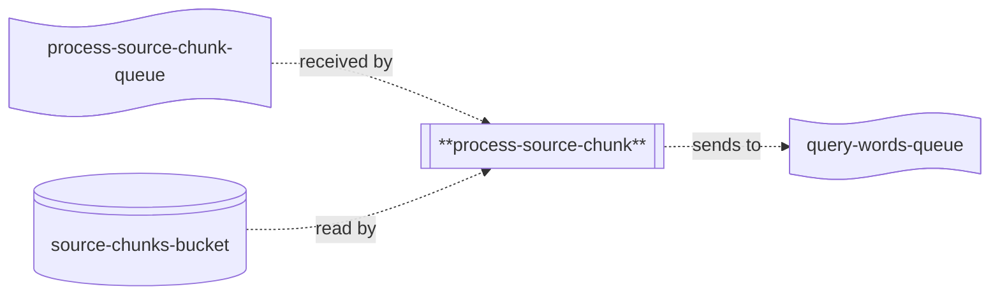

# process-source-chunk

## Description

This repo contains the source code for the `process-source-chunk` lambda, which is part of the Word List application's backend processing chain for updating word scores.



The `process-source-chunk` lambda receives a message containing information about a word list stored in S3. It uses that information to retrieve the word list, checks to see if the word should be queried (if the word exists, a flag must be present to indicate the word should be queried), and sends a message to the target query words queue if so.

## Environment Variables

The lambda uses the following environment variables:

| Variable Name                  | Description                                           |
|--------------------------------|-------------------------------------------------------|
| SOURCE_CHUNKS_BUCKET_NAME      | Name of the bucket the chunk should be received from. |
| QUERY_WORDS_QUEUE_URL          | Name of the queue to send query words messages to.    |

## Common Packages

This project uses the `WordList.Common` shared library (in the `lib-common` repository) which is published on GitHub.  To be able to import it, you'll need to use the following command:

```
dotnet nuget add source --username <your-username> --password <github-PAT> --store-password-in-clear-text --name github "https://nuget.pkg.github.com/word-list/index.json"
```